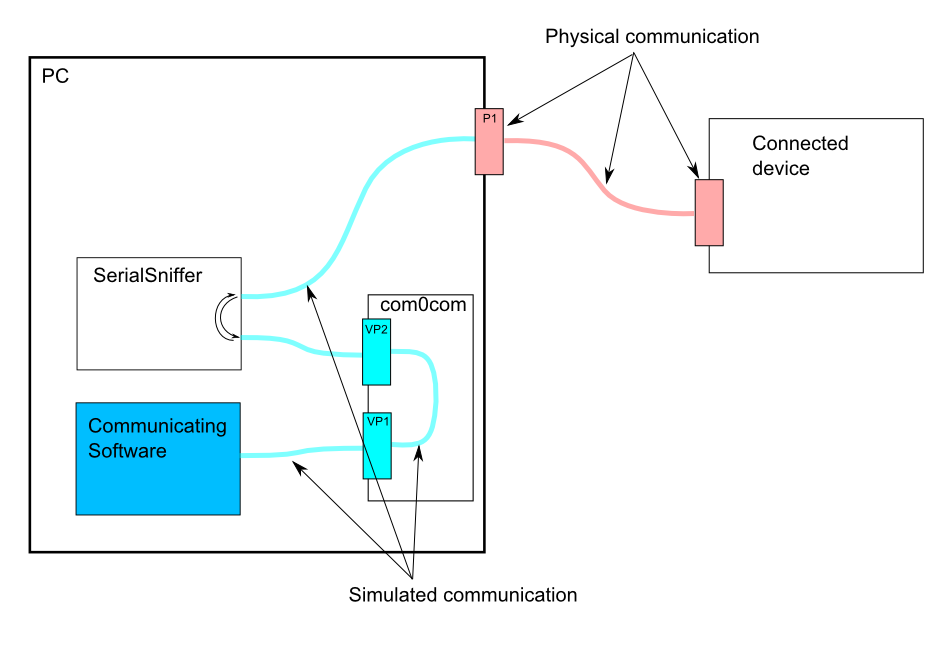

# Serial sniffer

Long story short - this project aims to provide an easy (or at least well documented) procedure of sniffing serial ports without using additional hardware. There are existing solutions to this problem but you would need to hit yourself pretty hard in your head to pay from $100 to $500 for any of them.

## Table of content
- [Concept](#concept)
- [Supported OS](#os)
    - [Windows](Windows/readme.md)
    - Linux - planned, 2nd priority
    - Mac OS - planned, 1st priority
- [TODOs](#todos)
- [Credits](#credits)

## Basics
In order to fully capture traffic both ways we need to have one real COM port that we want to sniff and 2 virtual ones since serial port can be used only by one program at the same time. The idea is to sniff incomming traffic from real COM and pass it through to one of virtual ones and do the same thing in reverse (sniff from virtual COM and pass it to real one). Communication between VCOM1 and VCOM2 is handled internally at a driver level.

Flow diagram taken from [SerialSniffer](https://github.com/fjovine/SerialSniffer):

## Supported OS:
| Platform                       | Support | Tested on                           |
| ------------------------------ | ------- | ----------------------------------- |
| [Windows](Windows/readme.md)  | ✅     | Windows 11 / AMD 3900X              |
| Linux                         | ❌     | Ubuntu 22.04 / VM on Win above      |
| Mac OS                        | ❌     | macOS 14 (ARM) / Mac 14 Pro with M2 |

## TODOs:
- [x] Gather docs for windows specific solution - first PoC
- [ ] Create python app handling communication between 2 virtual ports (remove SerialSniffer dependency)
- [ ] Add support for Mac OS
- [ ] Add support for Linux

## Credits
- SerialSniffer
    - [fjovine](https://github.com/fjovine) for creating [SerialSniffer](https://github.com/fjovine/SerialSniffer)
    - [xiaolaba](https://github.com/xiaolaba) for [fixing](https://github.com/xiaolaba/SerialSniffer) it
