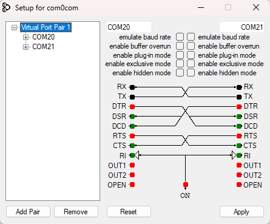

# Serial sniffer - Windows

## Installation guide

- Download [com0com](Windows\com0com-2.2.2.0-x64-fre-signed\setup.exe) 2.2.2.0 and install the virtual COM driver
- Open program called Setup in com0com installation directory (should be in `C:\Program Files (x86)\com0com`)
- Apply settings: 
  - Remove existing virtual port pair
  - Create new port pair and set names starting with COM (i.e. COM20, COM21)
  - At the end is should look like this:

  - 


- Open terminal
- Run
    ```bash
    .\SerialSniffer.exe -rx COM20 -tx COM13 -baud 115200 -output sniffed.txt
    ```

    Where:
     - COM20 - virtual port
     - COM13 - hardware serial port
     - 115200 - Baudrate for hardware serial port. 
       - If device is using CDC (Serial over USB), the value doesn't matter but is still required

